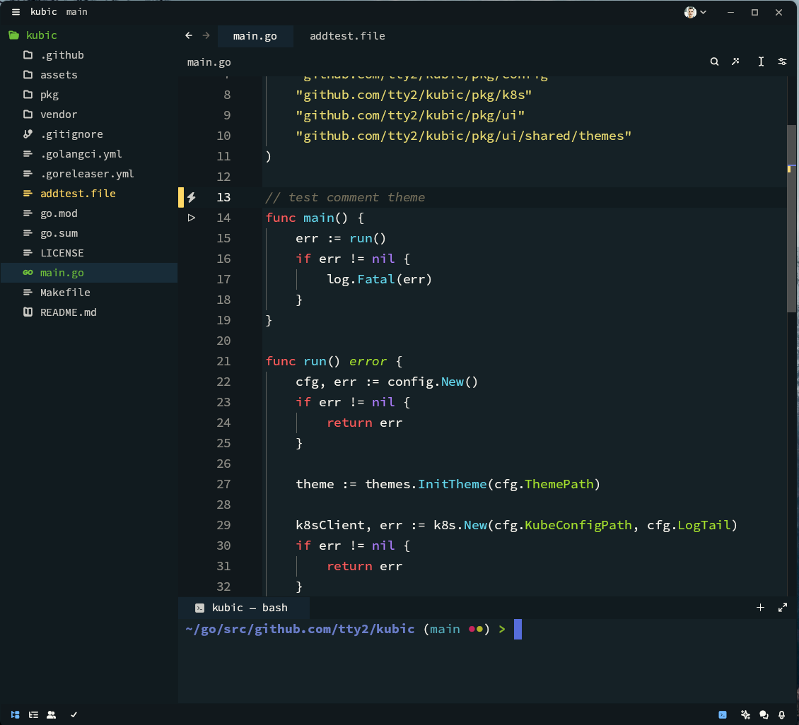

# monkey-zed-theme
Monkey theme for Zed editor

This theme is inspired by a popular Monokai theme with changes to dark blue background colors and more contrast.

# Installing

from repo folder

```
  cp monkey.json ~/.config/zed/themes
```

# Look


